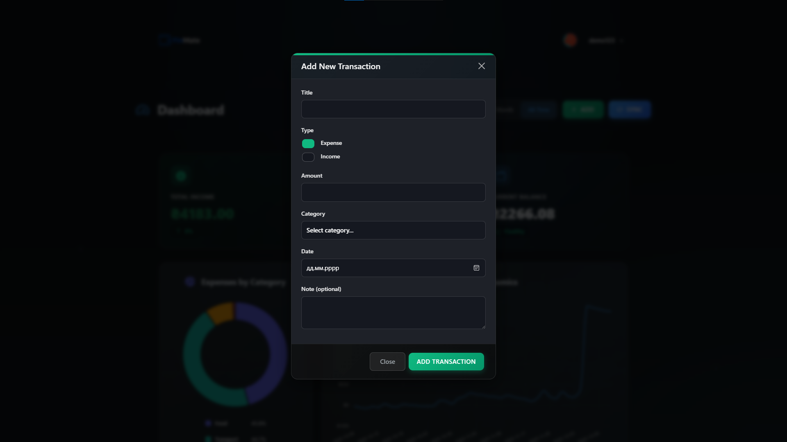
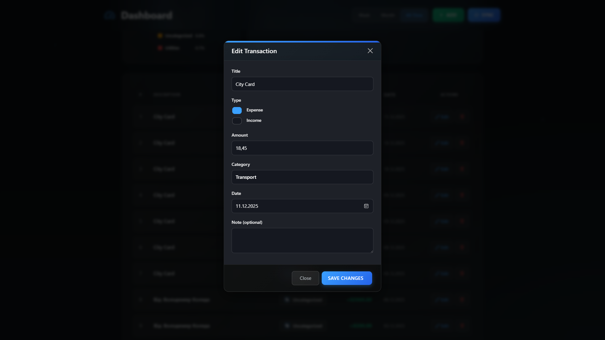

# FinMate — Personal Finance Tracker


## Overviewі
**FinMate** is a modern full-stack personal finance application. It helps users track income & expenses, manage budgets, and visualize financial health.
The project features a **Flask** backend with a robust REST API and a responsive frontend built with **Vite**, **Bootstrap 5**, and **Chart.js**.

>  **Note:** This project is currently a Work In Progress (MVP phase).
## Key Features
- Authentication: registration and login using JWT (Flask-JWT-Extended). The token is returned in the response and additionally set as a cookie for compatibility.
- Profile management: get/update profile, change password, manage Monobank token (PUT /api/v1/profile/monobank, DELETE /api/v1/profile/monobank).
- Transactions: create, edit, delete and fetch transactions (/api/v1/transactions/).
- Categories: CRUD endpoints for categories (/api/v1/categories/ and /api/v1/categories/all).
- Budgets: budget-related endpoints and services under `backend/finmate/budgets`.
- Dashboard: aggregated dashboard data for charts (/api/v1/dashboard?period=...).
- Monobank integration: sync transactions with `/api/v1/monobank/sync-transactions` (JWT protected).
- CORS: development origins are configured (`http://localhost:5173`, `http://127.0.0.1:5173`) and credentials support is enabled.
- **Performance:** Redis caching implemented for dashboard analytics, user profiles, and categories to reduce DB load.
- **Testing:** Unit and integration tests using **Pytest** to ensure stability.

## 🛠 Tech Stack
- **Backend:** Python, Flask, Flask-JWT-Extended, SQLAlchemy (ORM), Pydantic (Validation).
- **Database:** PostgreSQL (Production), Redis (Caching).
- - **Testing:** Pytest.
- **Frontend:** Vite, Bootstrap 5, Chart.js, Vanilla JS.
- **Tools:** Docker (planned), Git.


## Screenshots

Screenshots are located in `frontend_by_copilot/public/img/screenshots/`. Below is a compact 2x2 grid using the current filenames (dashboard images swapped as requested).

| Dashboard (1)                                                                 | Dashboard (2)                                                                 |
|-------------------------------------------------------------------------------|-------------------------------------------------------------------------------|
|  |  |

<details>
<summary>More screenshots</summary>

| Profile | Profile (edit) |
| --- | --- |
|  |  |

| Budgets | Login / Register |
| --- | --- |
|  |  |

| Add Transaction (modal) | Edit / Delete examples |
| --- | --- |
|  |  |

</details>

Installation & quick start
--------------------------
Below are minimal steps to run the project locally.

1) Prerequisites

Ensure you have **PostgreSQL** and **Redis** installed and running.
* **Redis:** You can run it via Docker: `docker run -d -p 6379:6379 redis` or install it locally.

2) Backend (Python)

Create and activate a virtual environment (recommended Python 3.11+):

```powershell
# Windows PowerShell
python -m venv .venv
.\.venv\Scripts\Activate.ps1
pip install -r backend/requirements.txt
```

Create a `.env` file or set environment variables:

```
SECRET_KEY=your-secret
JWT_SECRET_KEY=your-jwt-secret
ENCRYPTION_KEY=your-encryption-key
DATABASE_URL=postgresql+psycopg://postgres:   # or your DB URI
REDIS_URL=redis://localhost:6379/0
```

Run migrations (if needed) and start the backend:

```powershell
cd backend
flask db upgrade   # if you use migrations (ensure FLASK_APP is set if required)
python app.py
```

3) Running Tests

To run the test suite (Pytest):
```powershell
cd backend
pytest
```

4) Frontend

```powershell
cd frontend_by_copilot
npm install
npm run dev
# open http://localhost:5173
```

## 🔌 Main API Endpoints

| Method | Endpoint | Description |
| :--- | :--- | :--- |
| `POST` | `/api/v1/auth/login` | User login (JWT) |
| `POST` | `/api/v1/auth/register` | New user registration |
| `GET` | `/api/v1/dashboard` | Dashboard stats & charts data |
| `POST` | `/api/v1/monobank/sync` | Trigger Monobank synchronization |
| `GET` | `/api/v1/transactions` | Fetch all user transactions |
| `POST` | `/api/v1/transactions` | Add new expense/income |
| `PUT` | `/api/v1/transactions/<id>` | Update transaction details |
| `GET` | `/api/v1/categories/all` | Fetch user categories |
| `PUT` | `/api/v1/profile/monobank` | Update Monobank API Token |