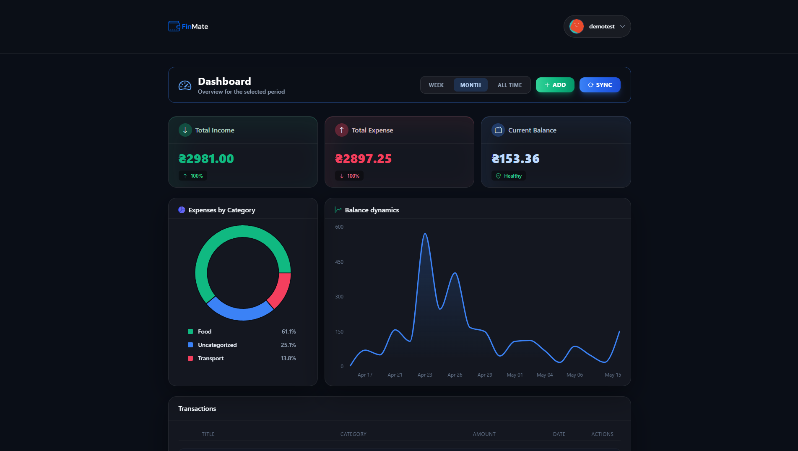
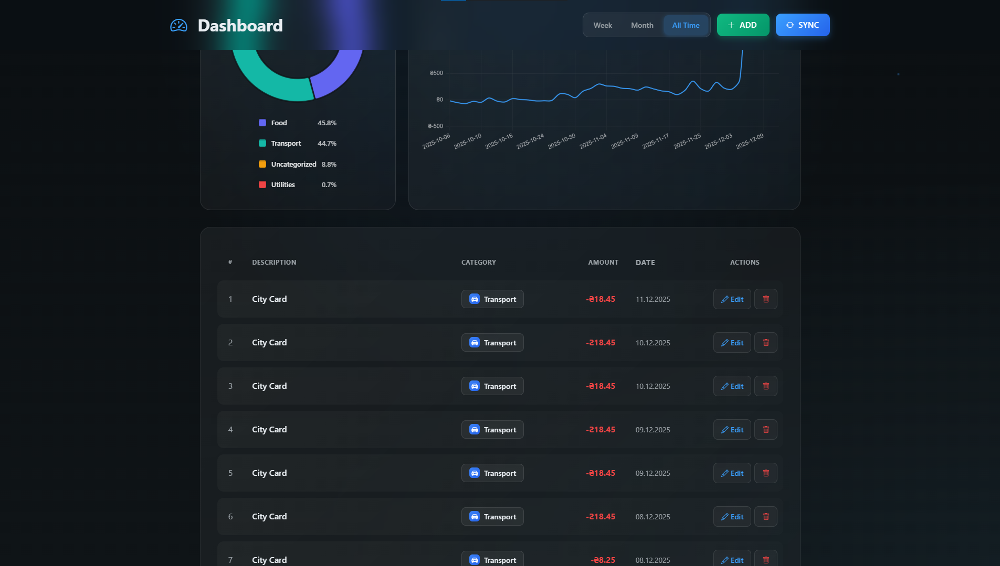
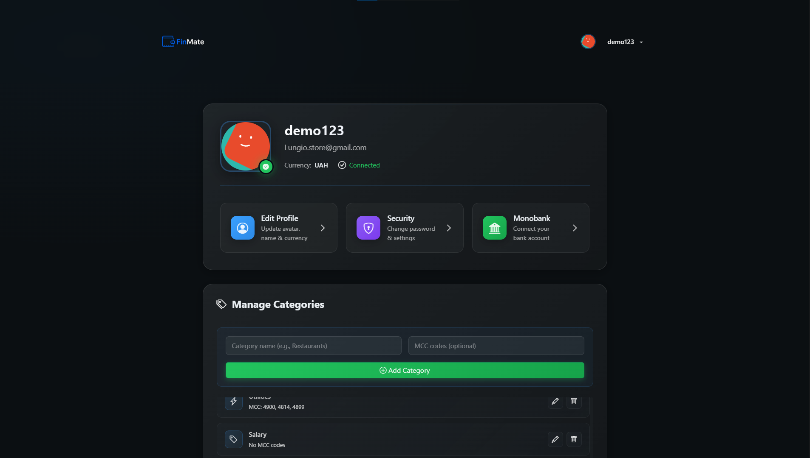
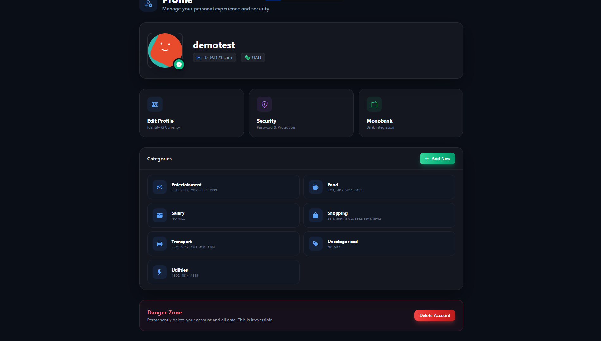
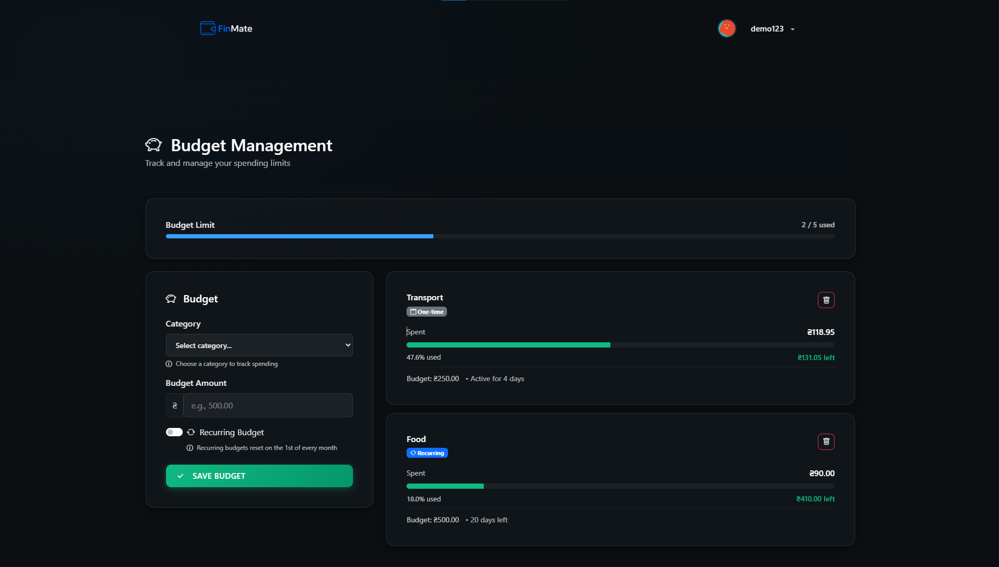
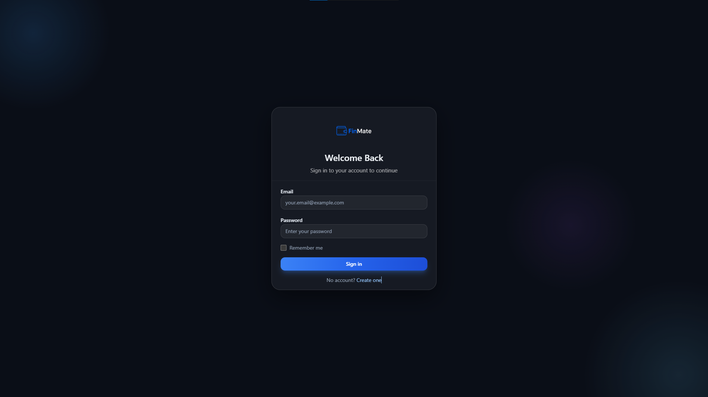

# FinMate — Personal Finance Tracker


## 🚀 Live Demo
Check out the application live at: **[https://fin-mate.app](https://fin-mate.app)**

## Overview
**FinMate** is a modern full-stack personal finance application designed to help users track income & expenses, manage budgets, and visualize financial health. The project features a robust **Flask** backend, an asynchronous task queue using **Celery**, and a responsive frontend built with **Vite** and **Bootstrap 5**.

> **Note:** The frontend architecture and UI logic were developed with the assistance of AI tools (GitHub Copilot), focusing on modern best practices and responsiveness.

## Key Features
- **Secure Authentication:**
    - Implementation of **Access** and **Refresh Tokens**.
    - **Token Rotation:** Refresh tokens are rotated upon use to prevent replay attacks.
    - **Token Blacklisting:** Logout logic invalidates tokens immediately using Redis with TTL.
- **Dashboard:** Dynamic financial overview with aggregated charts and stats.
- **Transactions & Categories:** Full CRUD operations for managing finances.
- **Monobank Integration:** Async synchronization of transactions using **Celery** workers.
- **Budgets:** Set and track monthly spending limits.
- **Performance:** **Redis** performs a dual role:
    1.  **Caching:** Stores heavy analytical queries (Dashboard) and user profiles.
    2.  **Message Broker:** Manages the task queue for Celery workers.
- **Testing:** Comprehensive test suite utilizing **Pytest** for backend logic validation.

## 🏗 Infrastructure & Deployment
The project is fully containerized and deployed to a production environment using a robust DevOps stack:

* **Cloud Provider:** DigitalOcean Droplet (Ubuntu Linux).
* **Containerization:** **Docker & Docker Compose** orchestrate the application services.
* **Web Server:** **Nginx** serves as a reverse proxy, handling load balancing and static file delivery.
* **Security:** Full **SSL/HTTPS** support configured via **Certbot (Let's Encrypt)**.

## 💡 Technical Highlights & Architecture
This section outlines specific engineering decisions made to ensure scalability and code maintainability.

### 1. Custom Caching Decorators
To avoid boilerplate code in services, a custom `@redis_cache` decorator was implemented. It handles:
- Automatic key generation based on function arguments.
- JSON serialization/deserialization.
- TTL (Time-To-Live) management.
- Logging of Cache Hits/Misses for monitoring.

### 2. Centralized Error Handling
Instead of try-except blocks scattered across controllers, a global `error_parser` is used. It intercepts exceptions and standardizes responses:
- **Business Errors:** Custom `FinMateError` exceptions return clear messages to the frontend.
- **Validation Errors:** `Pydantic` validation errors are parsed into a readable list of field-specific issues.
- **Unexpected Errors:** Generic 500 responses hide internal implementation details for security.

### 3. Advanced JWT Flow
The authentication system goes beyond simple login:
- **Refresh Token Rotation:** Every time a refresh token is used, a new pair (Access + Refresh) is issued, and the old refresh token is invalidated in the database.
- **"Remember Me" Logic:** Dynamic expiration times for tokens based on user preference (1 day vs 30 days).

### 4. Security & Data Protection
Security is a top priority for financial applications. Beyond standard JWT authentication, FinMate implements:
- **Fernet Encryption:** Monobank personal tokens are never stored in plain text. They are encrypted using the `cryptography` library before being saved to PostgreSQL and decrypted only in memory during Celery task execution. This protects user financial data in case of a database dump leak.

## 🛠 Tech Stack

### Backend
- **Python 3.11+ / Flask:** Core REST API.
- **Pydantic:** Data validation and schema definition.
- **Flask-JWT-Extended:** Token management.
- **Flask-Migrate:** Database migrations.
- **SQLAlchemy:** ORM for PostgreSQL.
- **Requests:** HTTP client for external APIs (Monobank).
- **Celery:** Asynchronous task queue.
- **Redis:** Cache & Broker.

### Frontend
- **Vite:** Build tool and development server.
- **Bootstrap 5:** Styling and layout.
- **Chart.js:** Data visualization.

## Screenshots

Screenshots are located in `frontend_by_copilot/public/img/screenshots/`.

| Dashboard (1) | Dashboard (2) |
|---|---|
|  |  |

<details>
<summary>More screenshots</summary>

| Profile | Profile (edit) |
| --- | --- |
|  |  |

| Budgets | Login / Register |
| --- | --- |
|  |  |

</details>

## ⚙️ Installation (Local Dev)

1.  **Clone the repository:**
    ```bash
    git clone https://github.com/a11ya11y-wq/finmate-flask.git
    cd finmate
    ```

2.  **Environment Setup:**
    Create a `.env` file in the root directory. You can use the example below:

    ```ini
    # Security
    SECRET_KEY="your-super-secret-key"
    ENCRYPTION_KEY="your-encryption-key"
    JWT_SECRET_KEY="your-jwt-secret-key"

    # Database (PostgreSQL)
    POSTGRES_USER="postgres"
    POSTGRES_PASSWORD="password"
    POSTGRES_DB="finmate_db"
    DATABASE_URL="postgresql+psycopg://postgres:password@db:5432/finmate_db"

    # Redis (Cache & Broker)
    REDIS_URL=redis://redis:6379/0
    CELERY_BROKER_URL=redis://redis:6379/0
    CELERY_RESULT_BACKEND=redis://redis:6379/0

    # Networking
    CORS_ORIGINS=http://localhost:3000,http://127.0.0.1:3000
    ```

3.  **Run with Docker (Recommended):**
    Ensure you have Docker and Docker Compose installed.

    * **Enable Development Mode (Optional):**
        To expose ports (DB: 5432, Backend: 5000, Redis: 6379) for local tools like Postman or DBeaver, create an override file from the development template:
        ```bash
        cp docker-compose.dev.yaml docker-compose.override.yaml
        ```

    * **Build and Run:**
        Docker will automatically pick up the override configuration if it exists.
        ```bash
        docker compose up -d --build
        ```
    The app will be available at `http://localhost:3000`.

4.  **Run Tests:**
    ```bash
    docker compose exec backend pytest
    ```

## 🔌 API Endpoints

| Method            | Endpoint                             | Description                                  |
|:------------------|:-------------------------------------|:---------------------------------------------|
| **Auth**          |                                      |                                              |
| `POST`            | `/api/v1/auth/register`              | Register a new user                          |
| `POST`            | `/api/v1/auth/login`                 | Login user (returns Access & Refresh Tokens) |
| `POST`            | `/api/v1/auth/refresh`               | Rotate tokens using Refresh Token            |
| `POST`            | `/api/v1/auth/logout`                | Logout user (blacklist tokens)               |
| **Transactions**  |                                      |                                              |
| `POST`            | `/api/v1/transactions/`              | Create transaction                           |
| `DELETE`          | `/api/v1/transactions/{id}`          | Delete transaction                           |
| `PUT`             | `/api/v1/transactions/{id}`          | Update transaction                           |
| `GET`             | `/api/v1/transactions/{id}`          | Getone transactions                          |
| **Categories**    |                                      |                                              |
| `POST`            | `/api/v1/categories/`                | Create category                              |
| `DELETE`          | `/api/v1/categories/{id}`            | Delete category                              |
| `PUT`             | `/api/v1/categories/<{id}`           | Update category                              |
| `GET`             | `/api/v1/categories/all`             | Get all categories                           |
| **Budgets**       |                                      |                                              |
| `POST`            | `/api/v1/budgets/`                   | Create or update budget                      |
| `DELETE`          | `/api/v1/budgets/{id}`               | Delete budget                                |
| `GET`             | `/api/v1/budgets/`                   | Get all budgets                              |
| **Profile**       |                                      |                                              |
| `GET`             | `/api/v1/profile/me`                 | Get user profile                             |
| `PUT`             | `/api/v1/profile/me`                 | Update user profile                          |
| `DELETE`          | `/api/v1/profile/me`                 | Delete user account                          |
| `POST`            | `/api/v1/profile/change-password`    | Change password                              |
| `PUT`             | `/api/v1/profile/monobank`           | Add/Update monobank token                    |
| `DELETE`          | `/api/v1/profile/monobank`           | Remove monobank token                        |
| **Dashboard**     |                                      |
| `GET`             | `/api/v1/dashboard/`                 | Get dashboard overview data                  |
| **Monobank Sync** |                                      |
| `POST`            | `/api/v1/monobank/sync-transactions` | Trigger manual sync of transactions          |
| `GET`             | `/api/v1/monobank/tasks/{id}`        | Get status of task                           |
