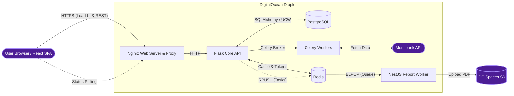

# FinMate — Personal Finance Tracker


## Backend & Architecture


## Frontend & Testing


## 🚀 Live Demo
Check out the application live at: **[https://fin-mate.app](https://fin-mate.app)**

## Overview
**FinMate** is a modern, decoupled personal finance application designed to help users track income & expenses, manage budgets, and visualize financial health. The project employs a **Service-Oriented Architecture (SOA)**, featuring a **Flask** backend for core business logic, **Celery** for background task processing (such as automated bank synchronization), a stateless **NestJS** worker for asynchronous PDF report generation, and a responsive frontend built with **React**.

> **Note:** The frontend architecture and UI logic were developed with the assistance of AI tools (GitHub Copilot), focusing on modern best practices and responsiveness.

## Key Features
- **Secure Authentication:**
    - Implementation of **Access** and **Refresh Tokens**.
    - **Token Rotation:** Refresh tokens are rotated upon use to prevent replay attacks.
    - **Token Blacklisting:** Logout logic invalidates tokens immediately using Redis with TTL.
- **Dashboard:** Dynamic financial overview with aggregated charts and stats.
- **Transactions & Categories:** Full CRUD operations for managing finances.
- **Monobank Integration:** Async synchronization of transactions using **Celery** workers.
- **Budgets:** Set and track monthly spending limits.
- **Distributed PDF Reporting (SOA):** A dedicated, stateless **NestJS** worker handles asynchronous financial report rendering to prevent blocking the main API thread.
- **Performance:** **Redis** is heavily utilized, performing a triple role:
    1.  **Caching:** Stores heavy analytical queries (Dashboard) and user profiles.
    2.  **Message Broker:** Manages the task queue for Celery workers.
    3.  **Task Queue & State Store:** Manages blocking queues (`BLPOP`) and short-lived execution states (`SETEX` with TTL) for the decoupled PDF Report worker.
- **Testing & Quality Assurance:**
    - **Backend Testing:** Comprehensive test suite utilizing **Pytest** with **90% code coverage** for core business logic.
    - **E2E Testing:** Robust End-to-End test coverage using **Playwright** paired with **Allure Reports** to ensure critical user journeys function flawlessly and provide comprehensive execution history.

## 🏗 Infrastructure & Deployment
The project is fully containerized and deployed via a GitHub Actions CI/CD pipeline.
* **Cloud Provider:** DigitalOcean Droplet (Ubuntu Linux).
* **Containerization:** **Docker & Docker Compose** orchestrate the application services.
* **Storage:** DigitalOcean Spaces (S3-compatible) for hosting generated PDF reports.
* **Web Server:** Nginx as a reverse proxy with Let's Encrypt SSL.



## 💡 Technical Highlights & Architecture
This section outlines specific engineering decisions made to ensure scalability, data integrity, and code maintainability.

### 1. Distributed Architecture (SOA) & Background Processing
The system is decoupled to prevent heavy operations from blocking the main API thread.
* **Stateless Report Worker:** A dedicated NestJS microservice handles PDF rendering via Playwright. It relies on Redis blocking queues (`BLPOP`) for 0% idle CPU usage and uses `SETEX` for frontend lazy-polling state management.
* **Celery Integration:** Background workers handle idempotent synchronization with the Monobank API, ensuring seamless external data aggregation.

### 2. Core Engineering Patterns
Business logic is strictly decoupled from the database layer and optimized for performance:
* **Unit of Work & Repository:** A custom UOW context manager encapsulates sessions, guaranteeing transaction atomicity and automatic rollbacks on failure. 
* **Smart Cache Management:** A custom `@redis_cache` decorator handles TTLs and serialization. Crucially, the UOW utilizes **post-commit hooks** to ensure cache invalidation triggers *only* after a successful Postgres commit, preventing race conditions.

### 3. Financial State Management
To prevent data drift, the application dynamically calculates balances rather than storing static snapshot values.
* **State Reconciliation:** During Monobank synchronization, the system fetches the absolute real-time card balance. To align the internal database with external reality without corrupting history, it performs a reverse algebraic calculation to retroactively adjust the user's base `initial_balance`.

### 4. Enterprise-Grade Security
* **Advanced JWT Flow:** Implements Refresh Token rotation (preventing replay attacks) and immediate Redis-backed token blacklisting upon logout.
* **Data Encryption:** External API keys (Monobank) are encrypted via the `cryptography` library (Fernet) before database storage, mitigating risks from potential data leaks.
* **DoS Protection:** Granular rate limiting via **Flask-Limiter** (backed by Redis), configured with `Werkzeug ProxyFix` to accurately resolve real client IPs through the Docker/Nginx reverse proxy.

## 🛠 Tech Stack

### Backend
- **Python 3.11+ / Flask:** Core REST API.
- **Pydantic:** Data validation and schema definition.
- **Flask-JWT-Extended:** Token management.
- **Flask-Migrate:** Database migrations.
- **SQLAlchemy:** ORM for PostgreSQL.
- **Requests:** HTTP client for external APIs (Monobank).
- **Celery:** Asynchronous task queue.
- **Redis:** Cache & Broker.

### Frontend
- **Framework/UI:** React 18, React Router, TypeScript
- **Build/Dev:** Vite + `@vitejs/plugin-react`
- **Styling:** Tailwind CSS, PostCSS, Autoprefixer
- **State Management:** Zustand
- **Validation:** Zod
- **Data Visualization:** Recharts

### Quality Assurance & Reporting
- **Testing Frameworks:** **Pytest** for backend unit/integration testing and **Playwright** for End-to-End (E2E) browser automation.
- **Code Coverage:** **pytest-cov** is used to measure and enforce test coverage (maintaining ~80% for core business logic) with automated HTML report generation.
- **Execution Reporting:** **Allure Reports** integrated with Playwright to generate comprehensive, interactive E2E test execution histories (including trace viewers and failure screenshots) published automatically via GitHub Pages.

## Screenshots

Screenshots are located in `frontend_by_copilot/public/img/screenshots/`.

| Dashboard (1) | Dashboard (2) |
|---|---|
|  |  |

<details>
<summary>More screenshots</summary>

| Profile | Profile (edit) |
| --- | --- |
|  |  |

| Budgets | Login / Register |
| --- | --- |
|  |  |

</details>

## ⚙️ Installation (Local Dev)

1.  **Clone the repository:**
    ```bash
    git clone https://github.com/a11ya11y-wq/finmate-flask.git
    cd finmate-flask
    ```

2.  **Environment Setup:**
    Create a `.env` file in the root directory. You can use the example below:

    ```ini
    # Security
    SECRET_KEY="your-super-secret-key"
    ENCRYPTION_KEY="your-encryption-key"
    JWT_SECRET_KEY="your-jwt-secret-key"

    # Database (PostgreSQL)
    POSTGRES_USER="postgres"
    POSTGRES_PASSWORD="password"
    POSTGRES_DB="finmate_db"

    # Api Main (Flask)
    FLASK_CONFIG=development
    API_MAIN_DATABASE_URL="postgresql+psycopg://postgres:password@db:5432/finmate_db"
    CORS_ORIGINS=http://localhost:3000,http://127.0.0.1:3000

    # Redis (Cache & Broker)
    REDIS_URL=redis://redis:6379/0
    CELERY_BROKER_URL=redis://redis:6379/0
    CELERY_RESULT_BACKEND=redis://redis:6379/0

    # REPORT_SERVICE (NESTJS)
    REPORT_REDIS_URL=redis://redis:6379/0
    REDIS_HOST="redis"
    REDIS_PORT="6379"

    #DigitalOcean Spaces
    DO_SPACES_KEY=your_spaces_key_here
    DO_SPACES_SECRET=your_spaces_secret_here
    DO_SPACES_ENDPOINT=your_spaces_endpoiny_here
    DO_SPACES_REGION=your_spaces_region_here
    DO_SPACES_BUCKET=your_spaces_bucket_here

    # Testing Enviroment
    TEST_DATABASE_URL="postgresql+psycopg://postgres:password@db:5432/finmate_test_db"
    TEST_REDIS_URL=redis://redis:6379/1

    ```

3.  **Run with Docker (Recommended):**
    Ensure you have Docker and Docker Compose installed.

    * **Enable Development Mode (Optional):**
        To expose ports (DB: 5432, Backend: 5000, Redis: 6379) for local tools like Postman or DBeaver, create an override file from the development template:
        ```bash
        cp docker-compose.dev.yaml docker-compose.override.yaml
        ```

    * **Build and Run:**
        Docker will automatically pick up the override configuration if it exists.
        ```bash
        docker compose up -d --build
        ```
    The app will be available at `http://localhost:3000`.

4.  **Run Tests:**
    * **Backend (Pytest):**
        ```bash
        docker compose exec api-main pytest
        ```
    * **E2E (Playwright):**
        ```bash
        cd frontend
        npm run test:e2e
        ```

## 🔌 API Endpoints

| Method            | Endpoint                             | Description                                  |
|:------------------|:-------------------------------------|:---------------------------------------------|
| **Auth**          |                                      |                                              |
| `POST`            | `/api/v1/auth/register`              | Register a new user                          |
| `POST`            | `/api/v1/auth/login`                 | Login user (returns Access & Refresh Tokens) |
| `POST`            | `/api/v1/auth/refresh`               | Rotate tokens using Refresh Token            |
| `POST`            | `/api/v1/auth/logout`                | Logout user (blacklist tokens)               |
| **Transactions**  |                                      |                                              |
| `POST`            | `/api/v1/transactions/`              | Create transaction                           |
| `DELETE`          | `/api/v1/transactions/{id}`          | Delete transaction                           |
| `PUT`             | `/api/v1/transactions/{id}`          | Update transaction                           |
| `GET`             | `/api/v1/transactions/{id}`          | Get one transactions                         |
| **Categories**    |                                      |                                              |
| `POST`            | `/api/v1/categories/`                | Create category                              |
| `DELETE`          | `/api/v1/categories/{id}`            | Delete category                              |
| `PUT`             | `/api/v1/categories/{id}`            | Update category                              |
| `GET`             | `/api/v1/categories/all`             | Get all categories                           |
| **Budgets**       |                                      |                                              |
| `POST`            | `/api/v1/budgets/`                   | Create or update budget                      |
| `DELETE`          | `/api/v1/budgets/{id}`               | Delete budget                                |
| `GET`             | `/api/v1/budgets/`                   | Get all budgets                              |
| **Profile**       |                                      |                                              |
| `GET`             | `/api/v1/profile/me`                 | Get user profile                             |
| `PUT`             | `/api/v1/profile/me`                 | Update user profile                          |
| `DELETE`          | `/api/v1/profile/me`                 | Delete user account                          |
| `POST`            | `/api/v1/profile/change-password`    | Change password                              |
| `PUT`             | `/api/v1/profile/monobank`           | Add/Update monobank token                    |
| `DELETE`          | `/api/v1/profile/monobank`           | Remove monobank token                        |
| **Dashboard**     |                                      |                                              |
| `GET`             | `/api/v1/dashboard/`                 | Get dashboard overview data                  |
| **Monobank Sync** |                                      |                                              |
| `POST`            | `/api/v1/monobank/sync-transactions` | Trigger manual sync of transactions          |
| `GET`             | `/api/v1/monobank/tasks/{id}`        | Get status of task                           |
| **Report Service**|                                      |                                              |
| `POST`            | `/api/v1/report/generate-pdf`        | Trigger pdf-generation                       |
| `GET`             |`/api/v1/report/generate-pdf/{id}/status`| Get task status                           |
| `GET`             | `/api/v1/report/history`             | Get history of user report generations       |
