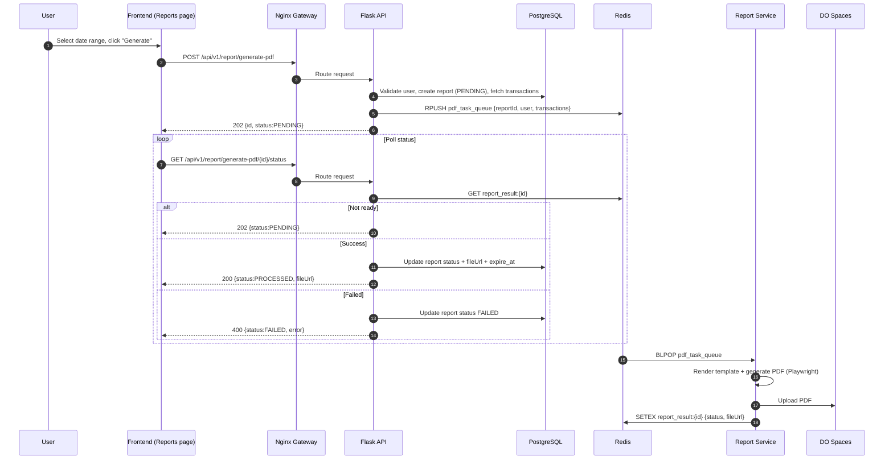

# FinMate System Diagrams

## 1. High-Level System Architecture

```mermaid
flowchart LR
    user((User))
    browser[Browser]
    user --> browser

    gateway[Nginx Gateway]
    browser -->|HTTPS| gateway

    subgraph Frontend
        fe[React/Vite UI]
    end

    subgraph Backend
        api[Flask API (api-main)]
        celery[Celery Worker]
        report[Report Service (NestJS Worker)]
    end

    subgraph DataStores
        db[(PostgreSQL)]
        redis[(Redis)]
    end

    subgraph External
        monobank[Monobank API]
        spaces[DO Spaces (S3)]
    end

    gateway -->|/| fe
    gateway -->|/api/v1/*| api

    fe -->|REST/JSON| api

    api --> db
    api --> redis

    api -->|background jobs| celery
    celery --> redis
    celery --> db
    celery --> monobank

    api -->|enqueue pdf_task_queue| redis
    report -->|BLPOP pdf_task_queue| redis
    report -->|report_result:*| redis
    report -->|upload PDF| spaces

    fe -->|download PDF| spaces
```

**Description:** The Nginx gateway routes browser traffic to the React frontend and the Flask API. The API handles auth, transactions, budgets, dashboards, monobank sync, and reports, persisting data in PostgreSQL and using Redis for caching, rate limiting, and async coordination. Celery workers execute long-running tasks (e.g., monobank sync) using Redis as broker/result store. The report-service is a separate NestJS worker that consumes report tasks from Redis, generates PDFs with Playwright/Handlebars, uploads them to DO Spaces, and stores the result back in Redis for the API to finalize.

## 2. Specific Data Flow: Report Generation (Sequence)



**Description:** The frontend requests a report for a date range. The API validates input, creates a PENDING report record, and enqueues a task in Redis with the transaction payload. The report-service worker consumes the task, renders the PDF, uploads it to DO Spaces, and writes a result key to Redis. The frontend polls the API status endpoint; once the result exists, the API finalizes the report in PostgreSQL and returns the file URL, which the frontend opens directly from DO Spaces.
